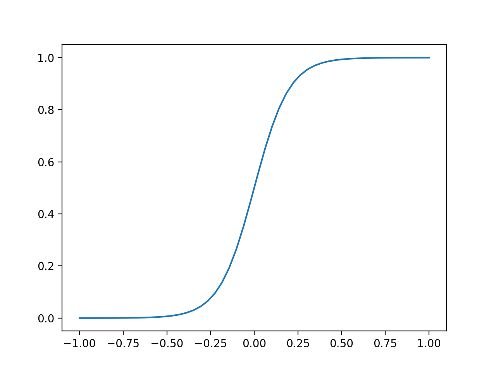
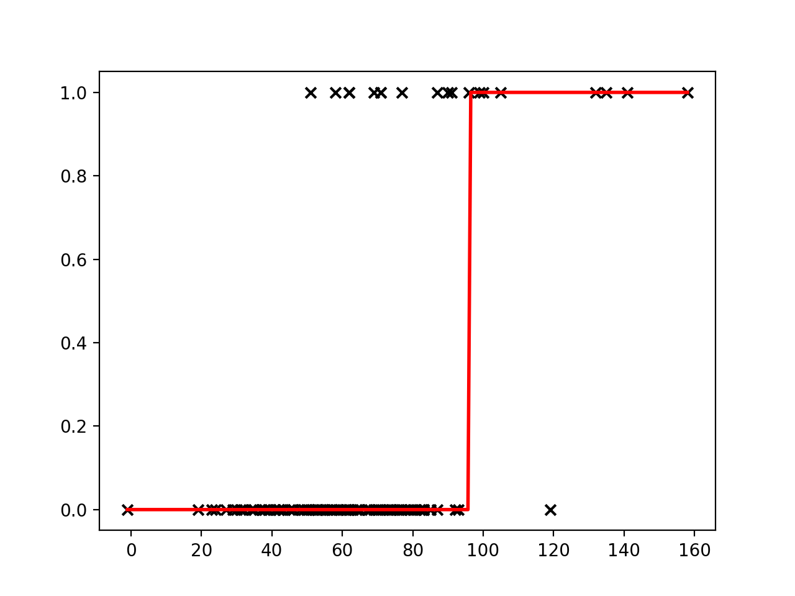

::::::::::::::::::::::::::::::::::::::: objectives

- Use a linear regression model for prediction.
- Use a logistic regression model for prediction.
- Use a decision tree model for prediction.
- Set a decision boundary to predict an outcome from a probability.

::::::::::::::::::::::::::::::::::::::::::::::::::

:::::::::::::::::::::::::::::::::::::::: questions

- Broadly speaking, when talking about regression and classification, how does the prediction target differ?
- Would linear regression be most useful for a regression or classification task? How about logistic regression?

::::::::::::::::::::::::::::::::::::::::::::::::::

## Regression vs classification

Predicting one or more classes is typically referred to as *classification*. The task of predicting a continuous variable on the other hand (for example, length of hospital stay) is typically referred to as a *regression*.

Note that "regression models" can be used for both regression tasks and classification tasks. Don't let this throw you off!

We will begin with a linear regression, a type of model borrowed from statistics that has all of the hallmarks of machine learning (so let's call it a machine learning model!), which can be written as:

$$
\hat{y} = wX + b
$$

Our predictions can be denoted by $\hat{y}$ (pronounced "y hat") and our explanatory variables (or "features") denoted by $X$. In our case, we will use a single feature: the APACHE-IV score, a measure of severity of illness.

There are two parameters of the model that we would like to learn from the training data: $w$, weight and $b$, bias. Could we use a linear regression for our classification task? Let's try fitting a line to our outcome data.

```python
# import the regression model
import numpy as np
from matplotlib import pyplot as plt
from sklearn.linear_model import LinearRegression
model = LinearRegression()

# use a single feature (apache score)
# note: remove the reshape if fitting to >1 input variable
X = cohort.apachescore.values.reshape(-1, 1)
y = cohort.actualhospitalmortality_enc.values

# fit the model to our data
model = model.fit(X, y)

# get the y values
buffer = 0.2*max(X)
X_fit = np.linspace(min(X) - buffer, max(X) + buffer, num=50)
y_fit = model.predict(X_fit)

# plot
plt.scatter(X, y,  color='black', marker = 'x')
plt.plot(X_fit, y_fit, color='red', linewidth=2)
plt.show()
```

{alt='Linear regression with binary outcome' width="600px"}

Linear regression places a line through a set of data points that minimizes the error between the line and the points. It is difficult to see how a meaningful threshold could be set to predict the binary outcome in our task. The predicted values can exceed our range of outcomes.

## Sigmoid function

The sigmoid function (also known as a logistic function) comes to our rescue. This function gives an "s" shaped curve that can take a number and map it into a value between 0 and 1:

$$f : \mathbb{R} \mapsto (0,1) $$

The sigmoid function can be written as:

$$f(x) = \frac{1}{1+e^{-x}}$$

Let's take a look at a curve generated by this function:

```python
def sigmoid(x, k=0.1):
    """
    Sigmoid function. 
    Adjust k to set slope.
    """
    s = 1 / (1 + np.exp(-x / k)) 
    return s

# set range of values for x
x = np.linspace(-1, 1, 50)

plt.plot(x, sigmoid(x))
plt.show()
```

{alt='Sigmoid function' width="600px"}

We can use this to map our linear regression to produce output values that fall between 0 and 1.

$$
f(x) = \frac{1}{1+e^{-({wX + b})}}
$$

As an added benefit, we can interpret the output value as a probability. The probability relates to the positive class (the outcome with value "1"), which in our case is in-hospital mortality ("EXPIRED").

## Logistic regression

Logistic regressions are powerful models that often outperform more sophisticated machine learning models.  In machine learning studies it is typical to include performance of a logistic regression model as a baseline (as they do, for example, in [Rajkomar and colleagues](https://www.nature.com/articles/s41746-018-0029-1#Sec20)).

We need to find the parameters for the best-fitting logistic model given our data. As before, we do this with the help of a loss function that quantifies error. Our goal is to find the parameters of the model that minimise the error. With this model, we no longer use least squares due to the model's non-linear properties. Instead we will use log loss.

## Training (or fitting) the model

As is typically the case when using machine learning packages, we don't need to code the loss function ourselves. The function is implemented as part of our machine learning package (in this case [scikit-learn](https://scikit-learn.org/stable/modules/generated/sklearn.linear_model.LogisticRegression.html)). Let's try fitting a Logistic Regression to our data.

:::::::::::::::::::::::::::::::::::::::  challenge

## Exercise

A) Following the previous example for a linear regression, fit a logistic regression to your data and create a new plot. How do the predictions differ from before? Hint: `from sklearn.linear_model import LogisticRegression`.

:::::::::::::::  solution

## Solution

A) You can reuse the Linear Regression code above and simply change `LinearRegression()` to `LogisticRegression()`. You should see a plot similar to the one below: {alt='Logistic regression' width="600px"}


:::::::::::::::::::::::::

::::::::::::::::::::::::::::::::::::::::::::::::::

## Decision boundary

Now that our model is able to output the probability of our outcome, we can set a decision boundary for the classification task. For example, we could classify probabilities of \< 0.5 as "ALIVE" and >= 0.5 as "EXPIRED". Using this approach, we can predict outcomes for a given input.

```python
x = [[90]]
outcome = model.predict(x)
probs = model.predict_proba(x)[0]
print(f'For x={x[0][0]}, we predict an outcome of "{outcome[0]}".\n'
      f'Class probabilities (0, 1): {round(probs[0],2), round(probs[1],2)}.')
```

```output
For x=90, we predict an outcome of "0".
Class probabilities (0, 1): (0.77, 0.23).
```

## An Alternative Model - Decision Trees

Decision trees are powerful and easy-to-interpret models for classification. They split data into smaller groups based on feature values, forming a tree-like structure where each path represents a decision. Because they capture non-linear patterns, decision trees are often used as a baseline model, similar to logistic regression.  

To build a decision tree, we need a way to measure how "pure" each split is. This is done using **Gini impurity** or **entropy**. Gini impurity measures how often a randomly chosen data point would be misclassified, while entropy quantifies uncertainty in a group. Lower values indicate purer splits. At each step, the tree selects the feature split that reduces impurity the most, ensuring that the final groups contain mostly one class.  

## Training (or fitting) the model  

As with logistic regression, we don’t need to code the splitting logic ourselves. The decision tree algorithm is implemented in machine learning libraries such as [scikit-learn](https://scikit-learn.org/stable/modules/generated/sklearn.tree.DecisionTreeClassifier.html). Let's try fitting a decision tree to our data.  

::::::::::::::::::::::::::::::::::::::: challenge  

## Exercise  

A) Following the previous example for logistic regression, fit a decision tree to your data and create a new plot. How do the predictions differ from before? Hint: `from sklearn.tree import DecisionTreeClassifier`.  

::::::::::::::: solution  

## Solution  

A) You can reuse the Linear Regression code above and simply change the model again to `DecisionTreeClassifier()`. You should see a plot similar to the one below: {alt='Logistic regression' width="600px"}

:::::::::::::::::::::::::

::::::::::::::::::::::::::::::::::::::::::::::::::

## Decision boundary  

A decision tree assigns class labels by following a series of if-then rules. Once trained, we can use it to classify new data points. For example, we can check how a tree predicts the outcome for a specific input:  

```python
x = [[90]]
outcome = model.predict(x)
probs = model.predict_proba(x)[0]
print(f'For x={x[0][0]}, we predict an outcome of "{outcome[0]}".\n'
      f'Class probabilities (0, 1): {round(probs[0],2), round(probs[1],2)}.')
```

```output
For x=90, we predict an outcome of "0".
Class probabilities (0, 1): (0.67, 0.33).
```  

This approach allows us to classify new inputs based on learned decision rules. Furthermore, the additional benefit of decision trees is that we can visualize the classification process by drawing out the final tree:

```python
from sklearn import tree
plt.figure(figsize=(30,15))
tree.plot_tree(model)
```

These outputs will show us the gini purity of each split in the decision tree. At the top of each node we can see a condition. The samples that satisfy that condition are split left and those that do not are split right.  We can see how many of the samples (listed as `values`) fall into each category which in our case is 0 and 1. At leaf nodes, we determine which category a particular input falls under by looking at the most common one in that node. 

:::::::::::::::::::::::::::::::::::::::: keypoints

- Linear regression is a popular model for regression tasks.
- Logistic regression is a popular model for classification tasks.
- Decision trees are a useful and easily interpretable alternative for classification tasks.
- Probabilities that can be mapped to a prediction class.

::::::::::::::::::::::::::::::::::::::::::::::::::


