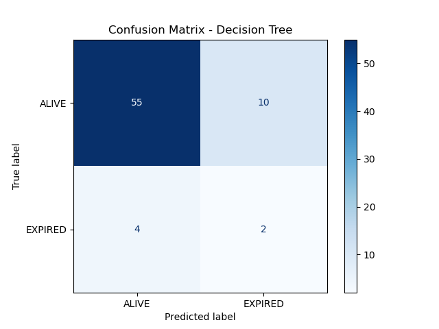
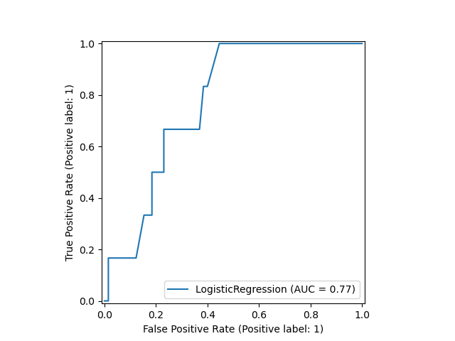
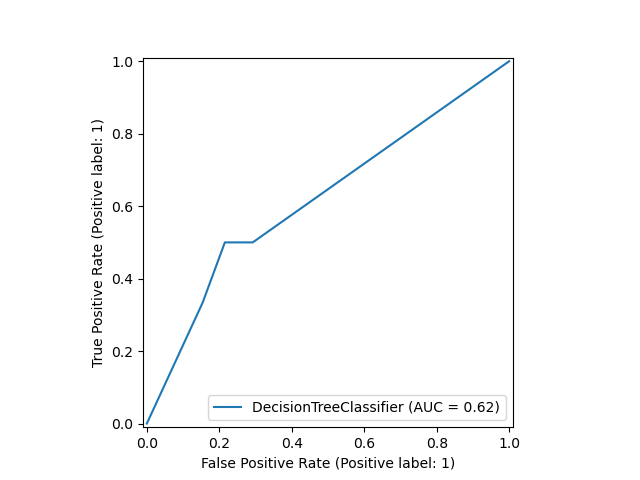

::::::::::::::::::::::::::::::::::::::: objectives

- Create a confusion matrix for a predictive model.
- Use the confusion matrix to compute popular performance metrics.
- Plot an AUROC curve.

::::::::::::::::::::::::::::::::::::::::::::::::::

:::::::::::::::::::::::::::::::::::::::: questions

- What kind of values go into a confusion matrix?
- What do the letters AUROC stand for?
- Does an AUROC of 0.5 indicate our predictions were good, bad, or average?
- In the context of evaluating performance of a classifier, what is TP?

::::::::::::::::::::::::::::::::::::::::::::::::::

## Evaluating a classification task

We trained a machine learning model to predict the outcome of patients admitted to intensive care units. As there are two outcomes, we refer to this as a "binary" classification task. We are now ready to evaluate the model on our held-out test set.

```python
import pandas as pd
import numpy as np
from sklearn.linear_model import LogisticRegression
from sklearn.tree import DecisionTreeClassifier
from sklearn.model_selection import train_test_split

# Convert outcome to categorical type
categories = ['ALIVE', 'EXPIRED']
cohort['actualhospitalmortality'] = pd.Categorical(cohort['actualhospitalmortality'], categories=categories)

# Encode categorical values
cohort['actualhospitalmortality_enc'] = cohort['actualhospitalmortality'].cat.codes
cohort[['actualhospitalmortality_enc', 'actualhospitalmortality']].head()

# Define features and outcome
features = ['apachescore']
outcome = ['actualhospitalmortality_enc']

# Partition data into training and test sets
X = cohort[features]
y = cohort[outcome]
x_train, x_test, y_train, y_test = train_test_split(X, y, train_size=0.7, random_state=42)

# Restructure data for model input
x_train = x_train.values.reshape(-1, 1)
y_train = y_train.values.ravel()
x_test = x_test.values.reshape(-1, 1)
y_test = y_test.values.ravel()

# Train logistic regression model
logreg = LogisticRegression(random_state=0)
logreg.fit(x_train, y_train)

# Train decision tree model
tree = DecisionTreeClassifier(random_state=0)
tree.fit(x_train, y_train)

# Generate predictions for logistic regression
y_hat_test_logreg = logreg.predict(x_test)
y_hat_test_proba_logreg = logreg.predict_proba(x_test)

# Generate predictions for decision tree
y_hat_test_tree = tree.predict(x_test)
y_hat_test_proba_tree = tree.predict_proba(x_test)
```

Each prediction is assigned a probability of a positive class. For example, the first 10 probabilities are:

```python
probs_logreg = y_hat_test_proba_logreg[:, 1][:12]
probs_tree = y_hat_test_proba_tree[:, 1][:12]

rounded_probs_logreg = [round(x, 2) for x in probs_logreg]
rounded_probs_tree = [round(x, 2) for x in probs_tree]

print("Logistic Regression Probabilities (rounded):", rounded_probs_logreg)
print("Decision Tree Probabilities (rounded):", rounded_probs_tree)
```

```output
Logistic Regression Probabilities (rounded): [0.09, 0.11, 0.23, 0.21, 0.23, 0.21, 0.19, 0.03, 0.2, 0.67, 0.54, 0.72]
Decision Tree Probabilities (rounded): [0.33, 0.0, 0.0, 0.0, 0.0, 0.0, 0.0, 0.0, 1.0, 1.0, 0.0, 0.0]
```

These probabilities correspond to the following predictions, either a "0" ("ALIVE") or a 1 ("EXPIRED"):

```python
print(y_hat_test_logreg[:12])
print(y_hat_test_tree[:12])
```

```output
[0 0 0 0 0 0 0 0 0 1 1 1]
[0 0 0 0 0 0 0 0 1 1 0 0]
```

In comparison with the known outcomes, we can put each prediction into one of the following categories:

- True positive: we predict "1" ("EXPIRED") and the true outcome is "1".
- True negative: we predict "0" ("ALIVE") and the true outcome is "0".
- False positive: we predict "1" ("EXPIRED") and the true outcome is "0".
- False negative: we predict "0" ("ALIVE") and the true outcome is "1".

```python
print(y_test[:12])
```

```output
[0 0 0 0 0 0 1 0 0 0 0 0]
```

## Confusion matrices

It is common practice to arrange these outcome categories into a "confusion matrix", which is a grid that records our predictions against the ground truth. For a binary outcome, confusion matrices are organised as follows:

|                   | Negative (predicted) | Positive  (predicted) | 
| :---------------- | :------------------: | :-------------------: |
| Negative (actual) | **TN**                     | FP                    | 
| Positive (actual) | FN                   | **TP**                      | 

The sum of the cells is the total number of predictions. The diagonal from top left to bottom right indicates correct predictions. Let's visualize the results of the model in the form of a confusion matrix:

```python
from sklearn import metrics

class_names = cohort['actualhospitalmortality'].cat.categories

disp_logreg = metrics.ConfusionMatrixDisplay.from_estimator(
    logreg, x_test, y_test, display_labels=class_names, cmap=plt.cm.Blues
)
plt.title("Confusion Matrix - Logistic Regression")
plt.show()

disp_tree = metrics.ConfusionMatrixDisplay.from_estimator(
    tree, x_test, y_test, display_labels=class_names, cmap=plt.cm.Blues
)
plt.title("Confusion Matrix - Decision Tree")
plt.show()
```

{alt='Confusion matrix for logistic regression' width="600px"}
{alt='Confusion matrix for decision trees' width="600px"}

We have two columns and rows because we have a binary outcome, but you can also extend the matrix to plot multi-class classification predictions. If we had more output classes, the number of columns and rows would match the number of classes.

## Accuracy

Accuracy is the overall proportion of correct predictions. Think of a dartboard. How many shots did we take? How many did we hit? Divide one by the other and that's the accuracy.

Accuracy can be written as:

$$
Accuracy = \frac{TP+TN}{TP+TN+FP+FN}
$$

What was the accuracy of our model?

```python
acc = metrics.accuracy_score(y_test, y_hat_test_logreg)
print(f"Accuracy (Logistic Regression) = {acc:.2f}")

acc = metrics.accuracy_score(y_test, y_hat_test_tree)
print(f"Accuracy (Decision Tree) = {acc:.2f}")
```

```output
Accuracy (Logistic Regression) = 0.82
Accuracy (Decision Tree) = 0.80
```

Not bad at first glance. When comparing our performance to guessing "0" for every patient, however, it seems slightly less impressive!

```python
zeros = np.zeros(len(y_test))
acc = metrics.accuracy_score(y_test, zeros)
print(f"Accuracy (zeros) = {acc:.2f}")
```

```output
Accuracy (zeros) = 0.92
```

The problem with accuracy as a metric is that it is heavily influenced by prevalence of the positive outcome: because the proportion of 1s is relatively low, classifying everything as 0 is a safe bet.

We can see that the high accuracy is possible despite totally missing our target. To evaluate an algorithm in a way that prevalence does not cloud our assessment, we often look at sensitivity and specificity.

## Sensitivity (A.K.A "Recall" and "True Positive Rate")

Sensitivity is the ability of an algorithm to predict a positive outcome when the actual outcome is positive. In our case, of the patients who die, what proportion did we correctly predict? This can be written as:

$$
Sensitivity = Recall = \frac{TP}{TP+FN}
$$

Because a model that calls "1" for everything has perfect sensitivity, this measure is not enough on its own. Alongside sensitivity we often report on specificity.

## Specificity (A.K.A "True Negative Rate")

Specificity relates to the test's ability to correctly classify patients who survive their stay (i.e. class "0"). Specificity is the proportion of those who survive who are predicted to survive. The formula for specificity is:

$$
Specificity = \frac{TN}{FP+TN}
$$

## Receiver-Operator Characteristic

A Receiver-Operator Characteristic (ROC) curve plots 1 - specificity vs. sensitivity at varying probability thresholds. The area under this curve is known as the AUROC (or sometimes just the "Area Under the Curve", AUC) and it is a well-used measure of discrimination that was originally developed by radar operators in the 1940s.

```python
from sklearn import metrics
metrics.RocCurveDisplay.from_estimator(logreg, x_test, y_test)
metrics.RocCurveDisplay.from_estimator(tree, x_test, y_test)
```

An AUROC of 0.5 is no better than guessing and an AUROC of 1.0 is perfect. An AUROC of 0.9 tells us that the 90% of times our model will assign a higher risk to a randomly selected patient with an event than to a randomly selected patient without an event

{alt='AUROC' width="600px"}
{alt='AUROC' width="600px"}


:::::::::::::::::::::::::::::::::::::::: keypoints

- Confusion matrices are the basis for many popular performance metrics.
- AUROC is the area under the receiver operating characteristic. 0.5 is bad!
- TP is True Positive, meaning that our prediction hit its target.

::::::::::::::::::::::::::::::::::::::::::::::::::


