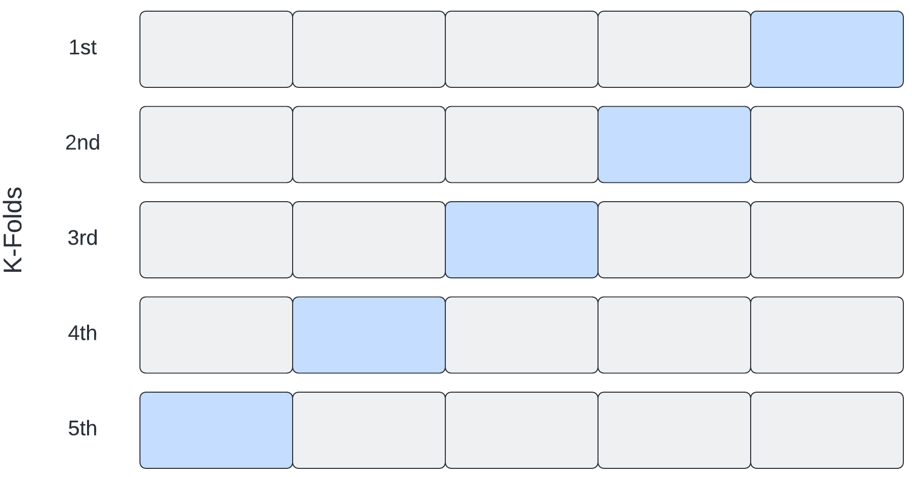

## Accuracy

One measure of the performance of a classification model is accuracy. Accuracy is defined as the overall proportion of correct predictions. If, for example, we make 50 predictions and 40 of them are correct, then our accuracy is 0.8 (40/50).

$$ Accuracy = \frac{Correct\ predictions}{All\ predictions}$$

What is the accuracy of our model at predicting in-hospital mortality?

```python
from sklearn.linear_model import LogisticRegression
from sklearn.model_selection import train_test_split

# convert outcome to a categorical type
cohort['actualhospitalmortality'] = cohort['actualhospitalmortality'].astype('category')

# add the encoded value to a new column
cohort['actualhospitalmortality_enc'] = cohort['actualhospitalmortality'].cat.codes
cohort[['actualhospitalmortality_enc','actualhospitalmortality']].head()

# define features and outcome
features = ['apachescore']
outcome = ['actualhospitalmortality_enc']

# partition data into training and test sets
X = cohort[features]
y = cohort[outcome]
x_train, x_test, y_train, y_test = train_test_split(X, y , train_size = 0.7,
                                                    random_state =  42)

# restructure data for input into model
x_train = x_train.values.reshape((len(x_train.values), 1))
y_train = y_train.values.ravel()
x_test = x_test.values.reshape((len(x_test.values), 1))
y_test = y_test.values.ravel()

# train model
reg = LogisticRegression(random_state=0)
reg.fit(x_train, y_train)

# generate predictions
y_hat_train = reg.predict(x_train)
y_hat_test = reg.predict(x_test)

#  accuracy on training set
acc_train = np.mean(y_hat_train == y_train)
print(f'Accuracy on training set: {acc_train:.2f}')

#  accuracy on test set
acc_test = np.mean(y_hat_test == y_test)
print(f'Accuracy on test set: {acc_test:.2f}')
```

```
Accuracy on training set: 0.86
Accuracy on test set: 0.82
```
{: .output}

Not bad! There was a slight drop in performance on our test set, but that is to be expected. We now want to tweak our model to see if we can improve the accuracy. Adding features might help?

## Validation set

Machine learning is iterative by nature. We want to improve our model, tuning and evaluating as we go. This leads us to a problem. Using our test set to iteratively improve our model would be cheating. It is supposed to be "held out", not used for training! So what do we do?

The answer is that we typically partition off part of our training set to use for validation. The "validation set" can be used to iteratively improve our model, allowing us to save our test set for the \*final\* evaluation.

{: width="600px"}

## Cross validation

Why stop at one validation set? With sampling, we can create many training sets and many validation sets, each slightly different. We can then average our findings over the partitions to give an estimate of the model's predictive performance

The family of resampling methods used for this is known as "cross validation". It turns out that one major benefit to cross validation is that it helps us to build more robust models. 

If we train our model on a single set of data, the model may learn rules that are overly specific (e.g. "all patients aged 63 years survive"). These rules will not generalise well to unseen data. When this happens, we say our model is "overfitted".

If we train on multiple, subtly-different versions of the data, we can identify rules that are likely to generalise better outside out training set, helping to avoid overfitting.

Two popular of the most popular cross-validation methods:
- K-fold cross validation
- Leave-one-out cross validation

## K-fold cross validation

In K-fold cross validation, "K" indicates the number of times we split our data into training/validation sets. With 5-fold cross validation, for example, we create 5 separate training/validation sets.

{: width="600px"}

With K-fold cross validation, we select our model to evaluate and then:
1. Partition the training data into a training set and a validation set. An 80%, 20% split is common.
2. Fit the model to the training set and make a record of the optimal parameters.
3. Evaluate performance on the validation set.
4. Repeat the process 5 times, then average the parameter and performance values.

When creating our training and test sets, we needed to be careful to avoid data leaks. The same applies when creating training and validation sets. We can use a `pipeline` object to help manage this issue.

```python
from numpy import mean, std
from sklearn.model_selection import cross_val_score, RepeatedStratifiedKFold
from sklearn.preprocessing import MinMaxScaler
from sklearn.pipeline import Pipeline

# define dataset
X = x_train
y = y_train

# define the pipeline
steps = list()
steps.append(('scaler', MinMaxScaler()))
steps.append(('model', LogisticRegression()))
pipeline = Pipeline(steps=steps)

# define the evaluation procedure
cv = RepeatedStratifiedKFold(n_splits=5, n_repeats=3, random_state=1)

# evaluate the model using cross-validation
scores = cross_val_score(pipeline, X, y, scoring='accuracy', cv=cv, n_jobs=-1)

# report performance
print('Cross-validation accuracy, mean (std): %.2f (%.2f)' % (mean(scores)*100, std(scores)*100))
```

```
Cross-validation accuracy, mean (std): 81.53 (3.31)
```
{: .output}

Leave-one-out cross validation is the same idea, except that we have many more folds. In fact, we have one fold for each data point. Each fold we leave out one data point for validation and use all of the other points for training.




