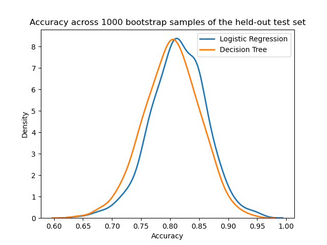
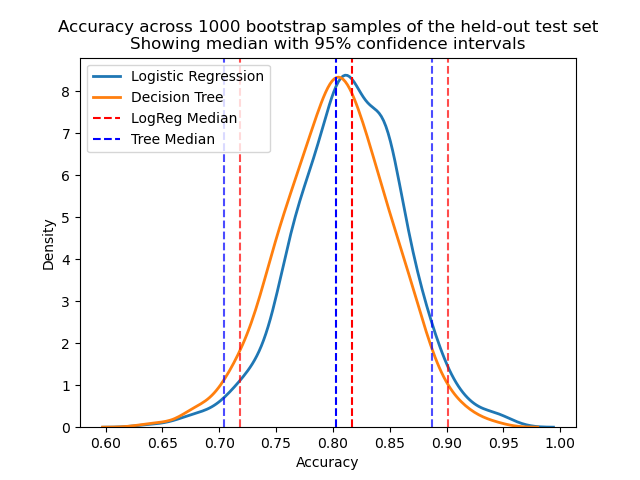

::::::::::::::::::::::::::::::::::::::: objectives

- Use bootstrapping to compute confidence intervals.

::::::::::::::::::::::::::::::::::::::::::::::::::

:::::::::::::::::::::::::::::::::::::::: questions

- Why do we 'boot up' computers?
- How is bootstrapping commonly used in machine learning?

::::::::::::::::::::::::::::::::::::::::::::::::::

## Bootstrapping

In statistics and machine learning, bootstrapping is a resampling technique that involves repeatedly drawing samples from our source data with replacement, often to estimate a population parameter. By "with replacement", we mean that the same data point may be included in our resampled dataset multiple times.

The term originates from the impossible idea of lifting ourselves up without external help, by pulling on our own bootstraps. Side note, but apparently it's also why we "boot" up a computer (to run software, software must first be run, so we bootstrap).

Typically our source data is only a small sample of the ground truth. Bootstrapping is loosely based on the law of large numbers, which says that with enough data the empirical distribution will be a good approximation of the true distribution.

Using bootstrapping, we can generate a distribution of estimates, rather than a single point estimate. The distribution gives us information about certainty, or the lack of it.

In [Figure 2 of the Rajkomar paper](https://www.nature.com/articles/s41746-018-0029-1/figures/2), the authors note that "the error bars represent the bootstrapped 95% confidence interval" for the AUROC values. Let's use the same approach to calculate a confidence interval when evaluating the accuracy of a model on a held-out test set. Steps:

1. Draw a sample of size N from the original dataset with replacement. This is a bootstrap sample.
2. Repeat step 1 S times, so that we have S bootstrap samples.
3. Estimate our value on each of the bootstrap samples, so that we have S estimates
4. Use the distribution of estimates for inference (for example, estimating the confidence intervals).

```python
import matplotlib.pyplot as plt
import numpy as np
from sklearn.linear_model import LogisticRegression
from sklearn.tree import DecisionTreeClassifier
from sklearn.model_selection import train_test_split
from sklearn.utils import resample
from sklearn import metrics

# Convert outcome to categorical type
categories = ['ALIVE', 'EXPIRED']
cohort['actualhospitalmortality'] = pd.Categorical(cohort['actualhospitalmortality'], categories=categories)

# Encode categorical values
cohort['actualhospitalmortality_enc'] = cohort['actualhospitalmortality'].cat.codes

# Define features and outcome
features = ['apachescore']
outcome = ['actualhospitalmortality_enc']

# Partition data into training and test sets
X = cohort[features]
y = cohort[outcome]
x_train, x_test, y_train, y_test = train_test_split(X, y, train_size=0.7, random_state=42)

# Reshape data for input into model
x_train = x_train.values.reshape(-1, 1)
y_train = y_train.values.ravel()
x_test = x_test.values.reshape(-1, 1)
y_test = y_test.values.ravel()

# Train Logistic Regression model
logreg = LogisticRegression(random_state=0)
logreg.fit(x_train, y_train)

# Train Decision Tree model
tree = DecisionTreeClassifier(random_state=0)
tree.fit(x_train, y_train)

# Bootstrap predictions for Logistic Regression
accuracy_logreg = []
accuracy_tree = []
n_iterations = 1000

for i in range(n_iterations):
    X_bs, y_bs = resample(x_test, y_test, replace=True)
    
    # Logistic Regression predictions
    y_hat_logreg = logreg.predict(X_bs)
    score_logreg = metrics.accuracy_score(y_bs, y_hat_logreg)
    accuracy_logreg.append(score_logreg)
    
    # Decision Tree predictions
    y_hat_tree = tree.predict(X_bs)
    score_tree = metrics.accuracy_score(y_bs, y_hat_tree)
    accuracy_tree.append(score_tree)
```

Let's plot a distribution of accuracy values computed on the bootstrap samples.

```python
import seaborn as sns
import matplotlib.pyplot as plt

# Plot distribution of bootstrap accuracy for both models
pd.Series(accuracy_logreg).plot.kde(label="Logistic Regression")
pd.Series(accuracy_tree).plot.kde(label="Decision Tree")

plt.title("Accuracy across 1000 bootstrap samples of the held-out test set")
plt.xlabel("Accuracy")
plt.ylabel("Density")
plt.legend()
plt.show()
```

{alt='Bootstrapped accuracy' width="600px"}

We can now take the mean accuracy across the bootstrap samples, and compute confidence intervals. There are several different approaches to computing the confidence interval. We will use the percentile method, a simpler approach that does not require our sampling distribution to be normally distributed.

## Percentile method

For a 95% confidence interval we can find the middle 95% bootstrap statistics. This is known as the percentile method. This is the preferred method because it works regardless of the shape of the sampling distribution.

Regardless of the shape of the bootstrap sampling distribution, we can use the percentile method to construct a confidence interval. Using this method, the 95% confidence interval is the range of points that cover the middle 95% of bootstrap sampling distribution.

We determine the mean of each sample, call it X̄ , and create the sampling distribution of the mean. We then take the α/2 and 1 - α/2 percentiles (e.g. the .025*1000 and .975*1000 = 25th and 975th bootstrapped statistic), and these are the confidence limits.

```python
# Alpha level (95% confidence)
alpha = 100 - 95

# Get median for logistic regression accuracy
median_logreg = np.percentile(accuracy_logreg, 50)
lower_ci_logreg = np.percentile(accuracy_logreg, alpha / 2)
upper_ci_logreg = np.percentile(accuracy_logreg, 100 - alpha / 2)

# Get median for decision tree accuracy
median_tree = np.percentile(accuracy_tree, 50)
lower_ci_tree = np.percentile(accuracy_tree, alpha / 2)
upper_ci_tree = np.percentile(accuracy_tree, 100 - alpha / 2)

print("Model accuracy is reported on the test set. 1000 bootstrapped samples were used to calculate 95% confidence intervals.\n")

print(f"Logistic Regression: Median accuracy = {median_logreg:.2f}, "
      f"95% CI = [{lower_ci_logreg:.2f}, {upper_ci_logreg:.2f}]")

print(f"Decision Tree: Median accuracy = {median_tree:.2f}, "
      f"95% CI = [{lower_ci_tree:.2f}, {upper_ci_tree:.2f}]")
```

```output
Model accuracy is reported on the test set. 1000 bootstrapped samples were used to calculate 95% confidence intervals.

Logistic Regression: Median accuracy = 0.82, 95% CI = [0.72, 0.90]
Decision Tree: Median accuracy = 0.80, 95% CI = [0.70, 0.89]
```

```python
# Plot distribution of bootstrap accuracy for both models
pd.Series(accuracy_logreg).plot.kde(label="Logistic Regression")
pd.Series(accuracy_tree).plot.kde(label="Decision Tree")

# Plot median and confidence intervals for Logistic Regression
plt.axvline(median_logreg, linestyle="--", color="red", label="LogReg Median")
plt.axvline(lower_ci_logreg, linestyle="--", color="red", alpha=0.7)
plt.axvline(upper_ci_logreg, linestyle="--", color="red", alpha=0.7)

# Plot median and confidence intervals for Decision Tree
plt.axvline(median_tree, linestyle="--", color="blue", label="Tree Median")
plt.axvline(lower_ci_tree, linestyle="--", color="blue", alpha=0.7)
plt.axvline(upper_ci_tree, linestyle="--", color="blue", alpha=0.7)

plt.title("Accuracy across 1000 bootstrap samples of the held-out test set\n"
          "Showing median with 95% confidence intervals")
plt.xlabel("Accuracy")
plt.ylabel("Density")
plt.legend()
plt.show()
```

{alt='Bootstrapped accuracy with confidence' width="600px"}

Once an interval is calculated, it may or may not contain the true value of the unknown parameter. A 95% confidence level does \*not\* mean that there is a 95% probability that the population parameter lies within the interval.

The confidence interval tells us about the reliability of the estimation procedure. 95% of confidence intervals computed at the 95% confidence level contain the true value of the parameter.


:::::::::::::::::::::::::::::::::::::::: keypoints

- Bootstrapping is a resampling technique, sometimes confused with cross-validation.
- Bootstrapping allows us to generate a distribution of estimates, rather than a single point estimate.
- Bootstrapping allows us to estimate uncertainty, allowing computation of confidence intervals.

::::::::::::::::::::::::::::::::::::::::::::::::::


